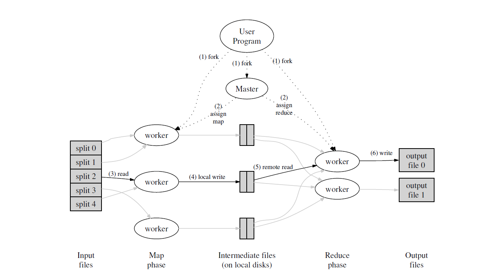

# Map-Reduce
This repository has Go implementation of Map-Reduce research paper published by Google

## Info about repository
* main directory has main functions for coordinator and worker process.
* mr directory has the actual implementation of the coordinator and worker process which will eventually call into map reduce functions defined in mrapps folder. 
* We need to pass input files as command line argument for coordinator process.  
* We need to pass user defined map and reduce function as argument for worker process.  
* Coordinator schedules map and reduce tasks.  
* Any number of workers can be launched and coordinator distributes the map and reduce tasks between these worker process.  

## Map-Reduce Architecture  
  

## Usage 
* Command to build user defined map reduce function:  
    go build -buildmode=plugin ../mrapps/wc.go  

* Command to run coordinator process  
    go run mrcoordinator.go inputFiles/pg-*.txt  

* Command to run worker process  
    go run mrworker.go wc.so  

